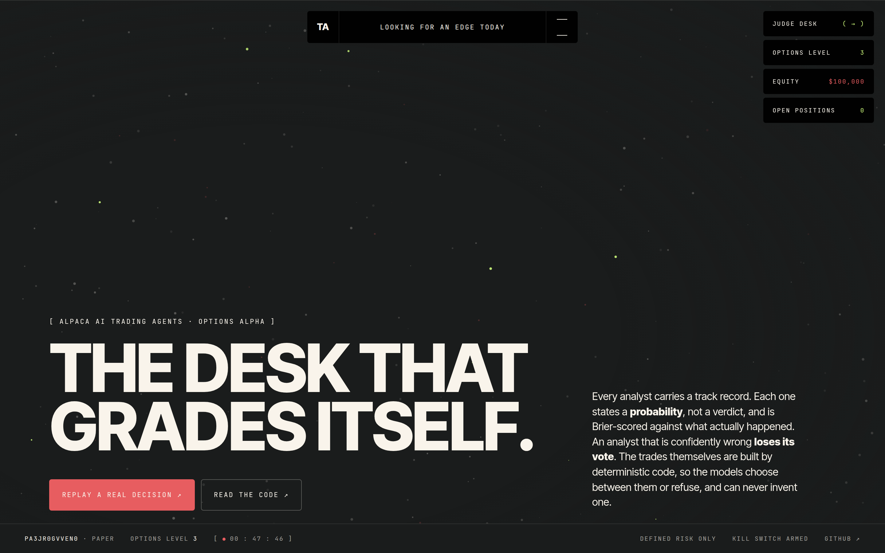
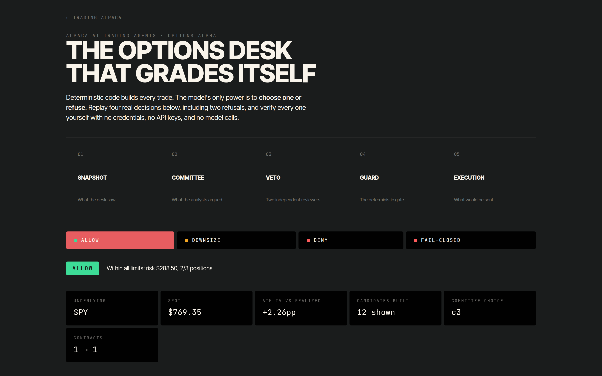
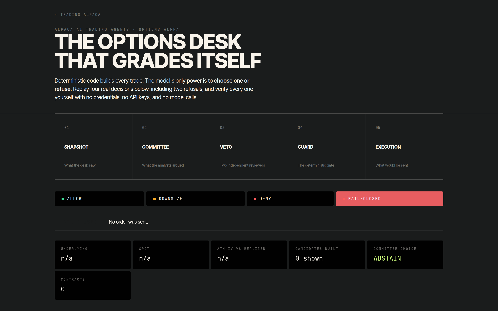
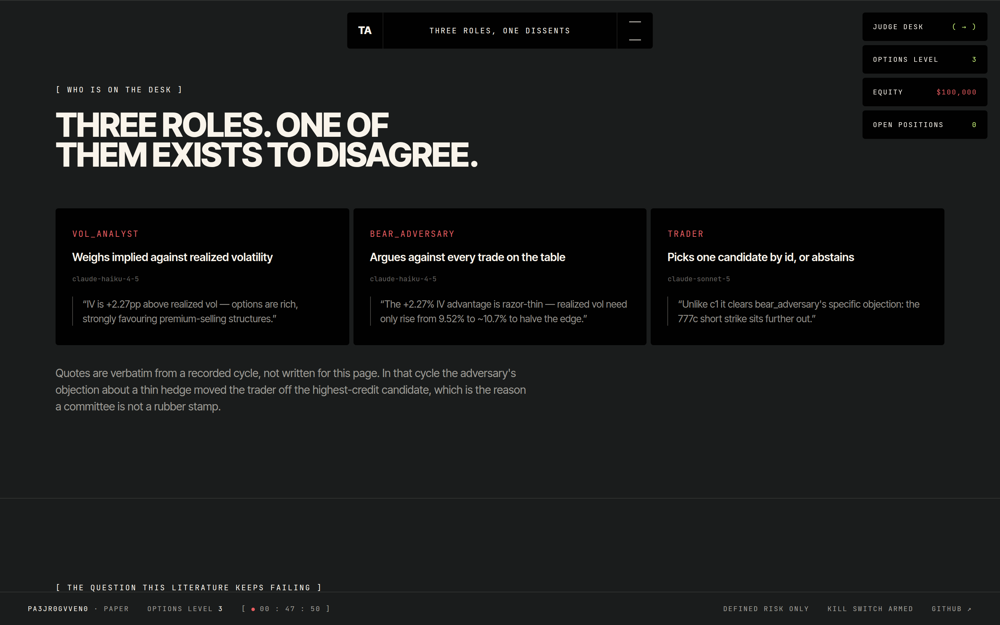
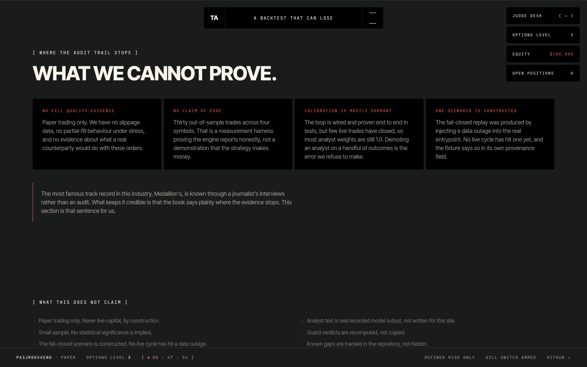
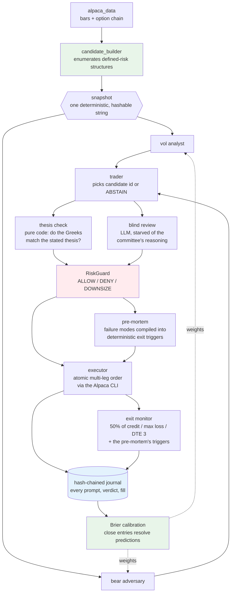

# Trading Alpaca — the options desk that grades itself

An AI options-trading agent where **deterministic code builds every trade and
the LLM's only power is to choose one or refuse.**

Built for the [Alpaca AI Trading Agents Hackathon](https://lablab.ai/event/alpaca-ai-trading-agents-hackathon)
(Options Alpha Agents track). Paper trading only.

**🌐 [Live site](https://trading-alpaca-judge.vercel.app)** · **[🛡️ Judge desk — replay four real decisions](https://trading-alpaca-judge.vercel.app/judge)**
no credentials, no API keys, no model calls. Two of the four are refusals.




<table>
<tr>
<td width="50%"><br>
<sub><b>Judge desk.</b> Every stage of a real decision, replayable with no credentials.</sub></td>
<td width="50%"><br>
<sub><b>A refusal.</b> Two of the four scenarios are refusals, deliberately.</sub></td>
</tr>
<tr>
<td><br>
<sub><b>The committee.</b> Quotes are verbatim recorded model output.</sub></td>
<td><br>
<sub><b>Where the audit trail stops.</b> Stated, not omitted.</sub></td>
</tr>
</table>

Most trading agents ask a language model *"what should I buy?"* and act on the
answer. That is fast to build and impossible to trust: the model can hallucinate
a strike, size a position wrongly, or be confidently wrong with no record of why.

This desk inverts the relationship. Deterministic Python enumerates every legal,
defined-risk options structure the live chain supports — every strike, leg, and
price fully specified before any model sees anything. The analyst committee may
then pick **one candidate by id, or ABSTAIN**. It cannot invent a strike, change
a quantity, or move a limit price, because there is no code path that would let
it. Every decision — including each refusal — is appended to a hash-chained
journal that anyone can verify without credentials.

---

## Architecture



Green is deterministic. **Red is the gate nothing reaches the broker without.**
Blue is the audit trail. The loop closes: the exit monitor journals a `close`
entry carrying the realized P&L and the cycle's `snapshot_hash`, calibration
joins that outcome back to the analyst predictions that produced it, and the
resulting weights are recomputed and applied on the next cycle. Everything
drawn exists and runs today.

---

## Judging axes

### Application of Technology

- **The LLM is bounded by construction, not by prompting.** The trader returns a
  `candidate_id` validated against the set generated that cycle; a hallucinated
  id is treated as ABSTAIN. Strikes and sizes are unreachable from the model.
- **A veto with decorrelated failure modes.** Two calls to the same model on the
  same context agree with each other and prove nothing. So one reviewer is
  *pure code* (does the position delta match the structure's own directional
  thesis?) and the other is an LLM deliberately **starved** of the committee's
  reasoning. Different evidence, different mechanism.
- **Fail loud on data, fail soft on the LLM.** A failed market-data fetch stops
  the session; a failed LLM call abstains. Missing data must never become a
  confident neutral opinion.
- **A leg we cannot price forces an abstention.** Greeks and IV are solved with
  Black–Scholes (`vollib`) from each leg's mid. When any leg is unpriceable the
  position Greeks return a sentinel that forces DENY, rather than silently
  contributing the remaining legs' Greeks — which measured wrong in both sign
  and magnitude (−22.2 against a true ≈ +12).
  *(Roadmap: Alpaca publishes its own Greeks and IV free on the indicative feed
  for ~61% of contracts; reconciling the two sources and flagging divergence is
  planned, not built.)*

### Business Value

- **Refusal is the product.** Every limit is enforced by [`risk.yaml`](risk.yaml)
  as the single source of truth: $1,000 max loss per position, 3 concurrent
  positions, one new trade per underlying per day, |net delta| ≤ 30,
  |net vega| ≤ 200, DTE 7–45, quote width ≤ 10% of mid, open interest ≥ 100,
  a 2% daily-loss halt, and size halving after three consecutive losses.
- **Defined risk is unrepresentable otherwise.** Only bull put spreads, bear
  call spreads, iron condors and long straddles can be constructed. There is no
  function that yields a naked short option.
- **The desk manages the book before it adds to it.** Every cycle evaluates
  the exits on what is already open first, so a protective exit is never
  skipped because the cycle later abstains. Three exits apply to every
  position whatever any model said — 50% of the credit received, max loss,
  and a forced close at 3 DTE so a short ITM leg is never assigned into stock
  at expiry — on top of whatever the pre-mortem compiled. Unwinding submits
  one new inverted multi-leg order, because `close_position` closes a single
  leg at a time and would leave a naked short between calls (verified live).
- **Fail-closed by construction.** A missing intent, missing portfolio state,
  unreadable config, or *any* internal exception in the guard returns DENY.
  This is verified by mutation testing, not by assertion.

### Originality

**Built:**

- **Abstention is first-class and load-bearing.** Each analyst emits a
  *probability*, not a verdict, and an abstaining analyst is excluded from both
  the numerator and the denominator of the aggregate — "no opinion" never
  masquerades as neutral. A live cycle abstained because its two analysts
  materially disagreed (0.66 vs 0.38); another changed the trader's choice from
  `c1` to `c4` because the adversary flagged c1's thin 356-contract hedge.
- **An adversary that argues against every trade**, whose objections are
  recorded in the journal whether or not they prevail.
- **Every LLM call is content-addressed** (`sha256(model, prompt)`) and cached
  with its prompt, raw response and parse result. One artifact serves as cost
  saver, audit record and deterministic replay corpus — a replayed cycle costs
  $0.00 and reproduces the decision verbatim.
- **The desk grades itself, and the loop is closed.** `exit_monitor.py`
  journals a `close` entry carrying `realized_pnl` and the originating
  `snapshot_hash`; `calibration.py` joins that outcome back to the
  `analyst_view` predictions of the cycle that produced it and scores each
  analyst with the standard Brier score; `committee/decide.py` recomputes the
  resulting voting weights from the journal on every cycle and records them
  in that cycle's `trader_choice` entry, so a judge can see which weights
  applied to which decision. Unproven analysts (< 10 resolved predictions)
  stay at exactly 1.0, a better-calibrated analyst outweighs a
  confidently-wrong one, and a demoted analyst floors at 0.2 rather than
  being silenced, so it always has a path back.
  **What that means today:** the paper account has few closed trades, so most
  weights are still 1.0 and live behaviour is unchanged — a regression test
  pins that the aggregate with all-1.0 weights is identical to the
  unweighted mean. `make calibration` says so outright rather than printing
  zeros that could pass for a score. What has changed is that the report is
  no longer structurally incapable of ever moving: an end-to-end test
  (`tests/test_exit_to_calibration.py`) drives ten real committee cycles
  through a real close and takes the report from "0 resolved / weight 1.00"
  to "10 resolved / brier 0.302 / weight 0.90".
- **A pre-mortem that becomes an enforced rule, not a paragraph.** Before an
  order is sent, `committee/premortem.py` asks the model what would have to
  be true for this trade to lose money — and then compiles the answer into
  machine-checkable `ExitTrigger`s the exit monitor evaluates every cycle.
  The model fills in values for a fixed set of four kinds and can no more
  invent a trigger kind than the trader can invent a strike: an unrecognised
  kind, a non-numeric threshold, or a value that is nonsense for the
  structure (an `underlying_beyond` on the winning side of spot, an
  `iv_spike` below current realized vol that would fire on entry) is
  discarded with a logged reason. The 3-DTE assignment-avoidance exit is
  always present whatever the model says, and an LLM failure falls back to
  the deterministic exits with `pre-mortem unavailable` recorded in every
  rationale. On a live SPY bear call spread it returned five valid triggers,
  every one correctly on the upside: the short strike, the breakeven, the
  max-loss level, an IV level at 1.9x realized, and a 7-DTE gamma exit.

### Presentation

- `make verify-journal` — anyone can verify the decision chain themselves, with
  no credentials. Empty, intact and tampered are three distinct outcomes.
- `make session-dry` runs the entire pipeline against the live chain and shows
  the committee's reasoning, both vetoes, the guard verdict and the exact wire
  payload — while sending nothing.
- Honest limitations stated below rather than omitted.
- **[A credential-free judge page](https://trading-alpaca-judge.vercel.app/judge)** replaying four
  recorded decisions. The verdicts and payloads are *recomputed* in the browser from the
  committed fixtures, not copied — and `python3 scripts/replay.py --all --verify` reproduces
  them locally with the environment stripped.

---

## Quickstart

```bash
make install                # dependencies
cp .env.example .env        # add your Alpaca PAPER keys
make check-account          # verifies $100k, options level 3, flat book, CLI present
make session-dry            # full pipeline against live data — sends nothing
make test                   # the suite
```

`make session-dry` output on a real chain, with the committee live
(SPY, 2026-08-29 — abridged reasoning):

```
SPY spot $769.35 — 632 candidate(s)
mode: LLM COMMITTEE — vol_analyst + bear_adversary -> trader -> thesis veto + blind veto
committee:
  vol_analyst      p=0.32 — IV is 0.69pp below realized vol ... all 12 candidates
                            are bear call spreads, the anti-favored structure type.
  bear_adversary   p=0.38 — we're selling premium that underprices actual movement;
                            bear calls are the wrong direction for that regime.
  aggregate probability: 0.35
  trader: ABSTAIN — ... no candidate clears the bar.
ABSTAIN: committee abstained — trader abstained: IV is below realized vol, which
favors buying premium, but every candidate this cycle is a bear call credit spread.
```

That is a refusal, and it exits 0. When the committee does name a candidate, the
run continues into the Greeks, the guard verdict and the exact wire payload:

```
Selected bear_call_spread: credit $2.83, max loss $217.00
position greeks: delta -8.0, vega +0.3
book: 0 position(s), delta +0.0, vega +0.0, day P&L $+0.00, 0 consecutive loss(es)
guard: ALLOW — Within all limits: risk $217.00, 1/3 positions (1 contract approved)
payload that would be sent: {"order_class": "mleg", "limit_price": "-2.83", ...}
DRY RUN — no order sent.
```

The negative limit price is Alpaca's convention for a net credit received.

**`--no-llm`** runs the identical pipeline with a deterministic selector (most
credit per dollar risked) instead of the committee, inside the same RiskGuard.
It exists so a live session survives a Claude rate limit: the desk degrades to a
dumber selector rather than going dark. The active mode is printed every cycle.

Every LLM call is keyed by `sha256(model, prompt)` and cached to
`logs/prompt_cache/` with its prompt, model, raw response, parsed result and
error. That one artifact is the cost saver, the audit record and the
deterministic-replay corpus at once — replaying the cycle above cost $0.00 and
made zero subprocess calls, and reproduced the same abstention verbatim.

---

## Safety

Eight rules the code enforces, not merely documents:

1. LLMs never invent strikes, quantities or order parameters.
2. Every order passes RiskGuard first; any error is DENY.
3. Defined-risk structures only. No naked short options. Paper account only, ever.
4. ABSTAIN is a first-class output. The desk is never forced to trade.
5. Every decision appends one hash-chained journal entry. Past entries are never edited.
6. **Kill switch:** create a `KILL_SWITCH` file in the repo root, or set `KILL=1`.
   Checked at startup and again before every order. It resolves relative to
   `risk.yaml`'s directory rather than the working directory, so it works
   identically under cron.
7. **Submitting requires an explicit `--live` flag.** `scripts/run_session.py`
   defaults to *not* submitting — `--dry-run`, no flags, and any malformed or
   ambiguous combination (e.g. `--live --dry-run` together) all run the whole
   pipeline (preflight, committee, vetoes, guard, payload) and stop before
   the broker call. Only `--live` alone sends an order, and it still cannot
   bypass the kill switch. `make session` — the shortest, most likely to be
   typed or accidentally triggered command — stays on the safe (no-submit)
   path; `make session-live` is the explicit, intentional live path.
   This closes a real incident: on 2026-08-29, backticks inside an unrelated
   `git commit -m` message were shell-expanded and executed `make session`,
   which (under the old submit-by-default behaviour) sent a real multi-leg
   paper order to Alpaca. It never filled (market closed) and was cancelled a
   minute later — the account verified clean, every guard, veto and journal
   check behaved correctly, and the journal recorded the incident rather than
   hiding it. But a command capable of reaching the broker should never be
   triggerable by a quoting accident in an unrelated shell command, so
   submitting is now opt-in rather than opt-out.
8. No on-chain code, and no unearned numbers (see below).

## Compliance

Orders route through the official **Alpaca CLI** (`alpaca api POST /v2/orders`,
wrapped by [`alpaca_cli.py`](alpaca_cli.py)), satisfying the rule that entries
use the Trading API plus the MCP server or the CLI. Market-data reads are
available through the official **MCP server**, declared in
[`.mcp.json`](.mcp.json) and restricted to `account,options-data,stock-data`.
**No trading toolset is exposed over MCP**, so an LLM cannot place an order
through it even in principle. `alpaca-py` is used for analysis only.

Evidence, including live CLI output and account provenance:
[`docs/COMPLIANCE.md`](docs/COMPLIANCE.md).

## What this does *not* claim

Judges deserve stated limits:

- **Paper trading, small sample.** A handful of trades proves nothing
  statistically, and we do not imply otherwise.
- **We deleted the previous author's performance claims.** This repo was
  converted from a crypto agent whose validation report printed hardcoded
  "82.2% OOS win rate / 3.79 profit factor / 366 trades" that were computed from
  nothing, and whose prompt claimed to be "derived from 1006 trade analyses".
  Both were removed rather than adapted, and replaced with a real walk-forward
  engine ([`walkforward.py`](walkforward.py)) whose every figure is computed from
  actual bars. `make validate` reports *"No walk-forward run on record"* when
  none exists rather than inventing one.
- **The vega limit binds on straddles, not verticals** — a spread's legs have
  nearly cancelling vega. That is correct behaviour, not a limit doing work.
- **Paper fills are simulated.** On 2026-08-31 the desk submitted and filled a
  live multi-leg order on the paper account — order `db977f0d`, a SPY bear call
  spread, sold 780C / bought 785C, filled at a $1.48 net credit against a $1.22
  limit. That proves the *mechanism* end to end: a real chain, a real committee
  vote, a real broker round trip. It does not prove edge. Alpaca simulates the
  fill against live quotes rather than matching a real counterparty, so no one
  took the other side, and one trade establishes nothing under any statistical
  test.
- **Richness is not edge.** The fitted volatility smile is a measurement. The median
  strike that clears its own bid-ask noise is worth roughly $3.94 per contract
  against a $4.00 median quoted spread, so richness is used only to break ties
  between strikes that are already viable on liquidity, DTE and risk grounds. See
  [`docs/research/smile-feasibility.md`](docs/research/smile-feasibility.md), which
  also records a signal-to-noise figure I published and later had to correct as not
  robust.
- Known gaps are tracked in [PLAN.md](PLAN.md) and the execution ledger in
  `docs/superpowers/records/`.

## Development

```
make test            # full suite
make validate        # validation report
make verify          # Merkle integrity of validation artifacts
make verify-journal  # hash chain of the decision journal
make walkforward     # out-of-sample validation on real bars
```

Design documents live in `docs/superpowers/specs/`, plans in
`docs/superpowers/plans/`, and a complete record of every engineering decision —
including defects found and rulings made — in `docs/superpowers/records/`.

## License

[MIT](LICENSE)
