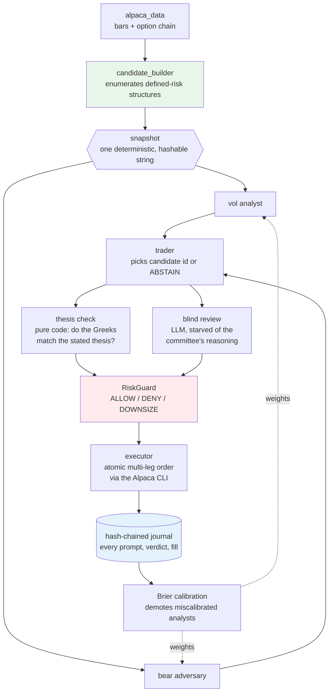

# Trading Alpaca — the options desk that grades itself

An AI options-trading agent where **deterministic code builds every trade and
the LLM's only power is to choose one or refuse.**

Built for the [Alpaca AI Trading Agents Hackathon](https://lablab.ai/event/alpaca-ai-trading-agents-hackathon)
(Options Alpha Agents track). Paper trading only.

Most trading agents ask a language model *"what should I buy?"* and act on the
answer. That is fast to build and impossible to trust: the model can hallucinate
a strike, size a position wrongly, or be confidently wrong with no record of why.

This desk inverts the relationship. Deterministic Python enumerates every legal,
defined-risk options structure the live chain supports — every strike, leg, and
price fully specified before any model sees anything. The analyst committee may
then pick **one candidate by id, or ABSTAIN**. It cannot invent a strike, change
a quantity, or move a limit price, because there is no code path that would let
it. Every decision — including each refusal — is appended to a hash-chained
journal that anyone can verify without credentials.

---

## Architecture



Green is deterministic. **Red is the gate nothing reaches the broker without.**
Blue is the audit trail. The dotted line is the loop that makes "grades itself"
literal: an analyst whose predictions score badly loses voting weight.

---

## Judging axes

### Application of Technology

- **The LLM is bounded by construction, not by prompting.** The trader returns a
  `candidate_id` validated against the set generated that cycle; a hallucinated
  id is treated as ABSTAIN. Strikes and sizes are unreachable from the model.
- **A veto with decorrelated failure modes.** Two calls to the same model on the
  same context agree with each other and prove nothing. So one reviewer is
  *pure code* (does the position delta match the structure's own directional
  thesis?) and the other is an LLM deliberately **starved** of the committee's
  reasoning. Different evidence, different mechanism.
- **Fail loud on data, fail soft on the LLM.** A failed market-data fetch stops
  the session; a failed LLM call abstains. Missing data must never become a
  confident neutral opinion.
- **A leg we cannot price forces an abstention.** Greeks and IV are solved with
  Black–Scholes (`vollib`) from each leg's mid. When any leg is unpriceable the
  position Greeks return a sentinel that forces DENY, rather than silently
  contributing the remaining legs' Greeks — which measured wrong in both sign
  and magnitude (−22.2 against a true ≈ +12).
  *(Roadmap: Alpaca publishes its own Greeks and IV free on the indicative feed
  for ~61% of contracts; reconciling the two sources and flagging divergence is
  planned, not built.)*

### Business Value

- **Refusal is the product.** Every limit is enforced by [`risk.yaml`](risk.yaml)
  as the single source of truth: $1,000 max loss per position, 3 concurrent
  positions, one new trade per underlying per day, |net delta| ≤ 30,
  |net vega| ≤ 200, DTE 7–45, quote width ≤ 10% of mid, open interest ≥ 100,
  a 2% daily-loss halt, and size halving after three consecutive losses.
- **Defined risk is unrepresentable otherwise.** Only bull put spreads, bear
  call spreads, iron condors and long straddles can be constructed. There is no
  function that yields a naked short option.
- **Fail-closed by construction.** A missing intent, missing portfolio state,
  unreadable config, or *any* internal exception in the guard returns DENY.
  This is verified by mutation testing, not by assertion.

### Originality

**Built:**

- **Abstention is first-class and load-bearing.** Each analyst emits a
  *probability*, not a verdict, and an abstaining analyst is excluded from both
  the numerator and the denominator of the aggregate — "no opinion" never
  masquerades as neutral. A live cycle abstained because its two analysts
  materially disagreed (0.66 vs 0.38); another changed the trader's choice from
  `c1` to `c4` because the adversary flagged c1's thin 356-contract hedge.
- **An adversary that argues against every trade**, whose objections are
  recorded in the journal whether or not they prevail.
- **Every LLM call is content-addressed** (`sha256(model, prompt)`) and cached
  with its prompt, raw response and parse result. One artifact serves as cost
  saver, audit record and deterministic replay corpus — a replayed cycle costs
  $0.00 and reproduces the decision verbatim.

**Planned, not yet built** — listed so this section is not read as shipped:

- *Calibration loop:* Brier-scoring analysts over resolved outcomes so a
  miscalibrated analyst loses voting weight.
- *Pre-mortem:* compiling "what would have to be true for this to lose" into
  deterministic exit triggers.

### Presentation

- `make verify-journal` — anyone can verify the decision chain themselves, with
  no credentials. Empty, intact and tampered are three distinct outcomes.
- `make session-dry` runs the entire pipeline against the live chain and shows
  the committee's reasoning, both vetoes, the guard verdict and the exact wire
  payload — while sending nothing.
- Honest limitations stated below rather than omitted.
- *Planned: a credential-free judge page with one-click replay of recorded
  decisions.*

---

## Quickstart

```bash
make install                # dependencies
cp .env.example .env        # add your Alpaca PAPER keys
make check-account          # verifies $100k, options level 3, flat book, CLI present
make session-dry            # full pipeline against live data — sends nothing
make test                   # the suite
```

`make session-dry` output on a real chain, with the committee live
(SPY, 2026-08-29 — abridged reasoning):

```
SPY spot $769.35 — 632 candidate(s)
mode: LLM COMMITTEE — vol_analyst + bear_adversary -> trader -> thesis veto + blind veto
committee:
  vol_analyst      p=0.32 — IV is 0.69pp below realized vol ... all 12 candidates
                            are bear call spreads, the anti-favored structure type.
  bear_adversary   p=0.38 — we're selling premium that underprices actual movement;
                            bear calls are the wrong direction for that regime.
  aggregate probability: 0.35
  trader: ABSTAIN — ... no candidate clears the bar.
ABSTAIN: committee abstained — trader abstained: IV is below realized vol, which
favors buying premium, but every candidate this cycle is a bear call credit spread.
```

That is a refusal, and it exits 0. When the committee does name a candidate, the
run continues into the Greeks, the guard verdict and the exact wire payload:

```
Selected bear_call_spread: credit $2.83, max loss $217.00
position greeks: delta -8.0, vega +0.3
book: 0 position(s), delta +0.0, vega +0.0, day P&L $+0.00, 0 consecutive loss(es)
guard: ALLOW — Within all limits: risk $217.00, 1/3 positions (1 contract approved)
payload that would be sent: {"order_class": "mleg", "limit_price": "-2.83", ...}
DRY RUN — no order sent.
```

The negative limit price is Alpaca's convention for a net credit received.

**`--no-llm`** runs the identical pipeline with a deterministic selector (most
credit per dollar risked) instead of the committee, inside the same RiskGuard.
It exists so a live session survives a Claude rate limit: the desk degrades to a
dumber selector rather than going dark. The active mode is printed every cycle.

Every LLM call is keyed by `sha256(model, prompt)` and cached to
`logs/prompt_cache/` with its prompt, model, raw response, parsed result and
error. That one artifact is the cost saver, the audit record and the
deterministic-replay corpus at once — replaying the cycle above cost $0.00 and
made zero subprocess calls, and reproduced the same abstention verbatim.

---

## Safety

Seven rules the code enforces, not merely documents:

1. LLMs never invent strikes, quantities or order parameters.
2. Every order passes RiskGuard first; any error is DENY.
3. Defined-risk structures only. No naked short options. Paper account only, ever.
4. ABSTAIN is a first-class output. The desk is never forced to trade.
5. Every decision appends one hash-chained journal entry. Past entries are never edited.
6. **Kill switch:** create a `KILL_SWITCH` file in the repo root, or set `KILL=1`.
   Checked at startup and again before every order. It resolves relative to
   `risk.yaml`'s directory rather than the working directory, so it works
   identically under cron.
7. No on-chain code, and no unearned numbers (see below).

## Compliance

Orders route through the official **Alpaca CLI** (`alpaca api POST /v2/orders`,
wrapped by [`alpaca_cli.py`](alpaca_cli.py)), satisfying the rule that entries
use the Trading API plus the MCP server or the CLI. Market-data reads are
available through the official **MCP server**, declared in
[`.mcp.json`](.mcp.json) and restricted to `account,options-data,stock-data`.
**No trading toolset is exposed over MCP**, so an LLM cannot place an order
through it even in principle. `alpaca-py` is used for analysis only.

Evidence, including live CLI output and account provenance:
[`docs/COMPLIANCE.md`](docs/COMPLIANCE.md).

## What this does *not* claim

Judges deserve stated limits:

- **Paper trading, small sample.** A handful of trades proves nothing
  statistically, and we do not imply otherwise.
- **We deleted the previous author's performance claims.** This repo was
  converted from a crypto agent whose validation report printed hardcoded
  "82.2% OOS win rate / 3.79 profit factor / 366 trades" that were computed from
  nothing, and whose prompt claimed to be "derived from 1006 trade analyses".
  Both were removed rather than adapted, and replaced with a real walk-forward
  engine ([`walkforward.py`](walkforward.py)) whose every figure is computed from
  actual bars. `make validate` reports *"No walk-forward run on record"* when
  none exists rather than inventing one.
- **The vega limit binds on straddles, not verticals** — a spread's legs have
  nearly cancelling vega. That is correct behaviour, not a limit doing work.
- Known gaps are tracked in [PLAN.md](PLAN.md) and the execution ledger in
  `docs/superpowers/records/`.

## Development

```
make test            # full suite
make validate        # validation report
make verify          # Merkle integrity of validation artifacts
make verify-journal  # hash chain of the decision journal
make walkforward     # out-of-sample validation on real bars
```

Design documents live in `docs/superpowers/specs/`, plans in
`docs/superpowers/plans/`, and a complete record of every engineering decision —
including defects found and rulings made — in `docs/superpowers/records/`.

## License

[MIT](LICENSE)
